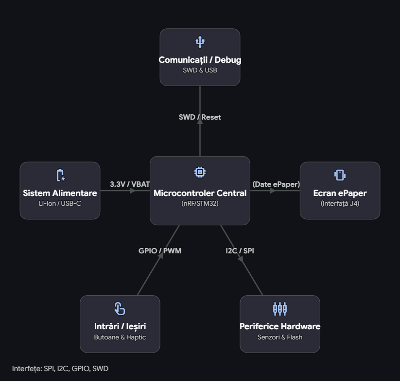

# Design Smartwatch

A smartwatch based on the Nordic nRF52840 microcontroller with an e-Paper display.
---

## Diagrama bloc

---

## Bill of Materials

| Ref | Componenta | Valoare | JLC Parts | Datasheet |
|-----|------------|---------|-----------|-----------|
| U1 | nRF52840 | $5.12   | [JLC](https://jlcpcb.com/parts/componentSearch?searchTxt=nRF52840-QF) | [DS](https://jlcpcb.com/api/file/downloadByFileSystemAccessId/8589839228197629952) |
| X1 | NX2016SA-32MHZ-EXS00A-CS11336 | $9.06   | [JLC](https://jlcpcb.com/partdetail/NDK-NX2016SA_32MHZ_EXS00ACS11336/C6134317) | [DS](https://jlcpcb.com/api/file/downloadByFileSystemAccessId/8603064888214908928) |
| X2 | FC-135_32.7680KA-A3 | $0.2923 | [JLC](https://jlcpcb.com/partdetail/SeikoEpson-FC_135_32_7680KAA3/C2650472) | [DS](https://jlcpcb.com/partdetail/SeikoEpson-FC_135_32_7680KAA3/C2650472) |
| L2 | RC0402JR-070RL | $0.02   | [JLC](https://jlcpcb.com/partdetail/YAGEO-RC0402JR070RL/C60485) | [DS](https://jlcpcb.com/api/file/downloadByFileSystemAccessId/8717146932348461056) |
| L3 | RC0402JR-070RL | $0.01   | [JLC](https://jlcpcb.com/partdetail/YAGEO-RC0402JR070RL/C60485) | [DS](https://jlcpcb.com/api/file/downloadByFileSystemAccessId/8717146932348461056) |
| L5 | 744043680 | $9.33   | [JLC](https://jlcpcb.com/partdetail/WurthElektronik-744043680/C2045671) | [DS](https://www.we-online.com/components/products/datasheet/744043680.pdf) |
| L7 | MLP2016SR47MT0S1 | $0.9    | [JLC](https://jlcpcb.com/partdetail/TDK-MLP2016SR47MT0S1/C87545) | [DS](https://jlcpcb.com/api/file/downloadByFileSystemAccessId/8588933367512879104) |
| IC1 | BQ25180YBGR | $2.04   | [JLC](https://jlcpcb.com/partdetail/TexasInstruments-BQ25180YBGR/C3682423) | [DS](https://www.ti.com/cn/lit/gpn/bq25180) |
| IC2 | DRV2605YZFR | $1.61   | [JLC](https://jlcpcb.com/partdetail/TexasInstruments-DRV2605YZFR/C81079) | [DS](https://www.ti.com/cn/lit/gpn/drv2605) |
| IC3 | BMA423 | $12.30  | [JLC](https://jlcpcb.com/partdetail/BoschSensortec-BMA423/C189517) | [DS](https://jlcpcb.com/api/file/downloadByFileSystemAccessId/8588894317147017216) |
| IC9 | RT6160 | $0.46   | [JLC](https://jlcpcb.com/partdetail/RichtekTech-RT6160AWSC/C7065276) | [DS](https://jlcpcb.com/api/file/downloadByFileSystemAccessId/8600398231234883584) |
| ANT1 | 2450AT18B100E | $1.04   | [JLC](https://jlcpcb.com/partdetail/JohansonDielectrics-2450AT18B100E/C2917717) | [DS](https://jlcpcb.com/api/file/downloadByFileSystemAccessId/8588940948130156544) |
| D2 | MBR0530 | $0.02   | [JLC](https://jlcpcb.com/partdetail/78464-MBR0530/C77336) | [DS](https://jlcpcb.com/api/file/downloadByFileSystemAccessId/8586175081181818880) |
| D3 | USBLC6-2SC6Y | $0.23   | [JLC](https://jlcpcb.com/partdetail/STMicroelectronics-USBLC62SC6Y/C2969755) | [DS](https://jlcpcb.com/api/file/downloadByFileSystemAccessId/8603165824304111616) |
| D4 | MBR0530 | $0.03   | [JLC](https://jlcpcb.com/partdetail/78464-MBR0530/C77336) | [DS](https://jlcpcb.com/api/file/downloadByFileSystemAccessId/8586175081181818880) |
| D5 | MBR0530 | $0.04   | [JLC](https://jlcpcb.com/partdetail/78464-MBR0530/C77336) | [DS](https://jlcpcb.com/api/file/downloadByFileSystemAccessId/8586175081181818880) |
| Q1 | DMG2305UX-7 | $0.15   | [JLC](https://jlcpcb.com/partdetail/DiodesIncorporated-DMG2305UX7/C150470) | [DS](https://jlcpcb.com/api/file/downloadByFileSystemAccessId/8560079443617075200) |
| Q3 | SI1308EDL-T1-GE3 | $0.15   | [JLC](https://jlcpcb.com/partdetail/VishayIntertech-SI1308EDL_T1GE3/C469327) | [DS](https://jlcpcb.com/api/file/downloadByFileSystemAccessId/8588884784742846464) |
| J1 | 503480-2400 | $0.67   | [JLC](https://jlcpcb.com/partdetail/MOLEX-5034802400/C122434) | [DS](https://www.molex.com/content/dam/molex/molex-dot-com/products/automated/en-us/salesdrawingpdf/503/503480/5034802400_sd.pdf?inline) |
| J4 | KH-TYPE-C-16P | $0.05   | [JLC](https://jlcpcb.com/partdetail/Shenzhen_KinghelmElec-KH_TYPE_C16P/C709357) | [DS](https://jlcpcb.com/api/file/downloadByFileSystemAccessId/8588905154556923904) |
| U3 | MAX17048G-T10 | $2.76   | [JLC](https://jlcpcb.com/partdetail/2777647-MAX17048GT10/C2682616) | [DS](https://jlcpcb.com/api/file/downloadByFileSystemAccessId/8588907428524003328) |
| SWD | TC2030-IDC | $101.26 | [JLC](https://jlcpcb.com/partdetail/MicrochipTech-TC2030_CLIP3PACK/C5444772) | [DS](https://www.lcsc.com/datasheet/lcsc_datasheet_2403201318_Microchip-Tech-TC2030-CLIP-3PACK_C5444772.pdf) |

---

## Descriere Functionalitati Hardware

### Microcontroller - nRF52840

Arhitectura:
- Procesor ARM Cortex-M4 cu FPU ruland la 64 MHz
- 1 MB memorie Flash si 256 KB RAM
- Suport nativ pentru Bluetooth 5, Bluetooth Low Energy (BLE), Thread si Zigbee
- Dispune de USB 2.0 (Full Speed), SPI, I2C, UART si QSPI
 
### Display E-Paper - Waveshare 1.54" V2
 
Display-ul comunica prin SPI pe 4 fire:
- Rezolutie: 200x200 pixeli
- Interfata comunicare: SPI
- Consum de energie ultra-redus; consuma aproximativ 26.4 mW doar in timpul reimprospatarii si scade sub 0.01 uA in modul standby
- Suporta partial refresh (reimprospatarea doar a unei anumite zone din ecran)
 
### IMU - BMA423
 
Accelerometrul BMA423 comunica prin I2C:

- Tip senzor: Accelerometru digital pe 3 axe.
- Rezolutie date - 12 biti
- Interfete comunicare: I2C si SPI
- Consum foarte eficient, trage in jur de 14 uA cand se afla in modul activ de numarare a pasilor
 
### Incarcator Baterie - BQ25180

- Dimensiuni: 32.5mm x 21mm x 5.5mm
- Curent de incarcare: Flexibil, poate incarca de la cativa miliamperi pana la 1 A
- Interfata control: Comunicare I2C prin care procesorul principal poate citi statusul bateriei si poate modifica parametrii de incarcare din mers
- Tensiune standard de intrare de 5V, dar are protectie la supratensiune (OVP) care rezista pana la 25V
 
### Baterie - AKYGA LP502030
 
- Tensiune - 3.7V nominal (ajunge la 4.2V cand este incarcata 100% si scade spre 3.0V cand este descarcata)
- Capacitate: Aproximativ 250 mAh
- Dimensiuni - 5 mm x 20 mm x 30 mm
 
### Motor Vibratii - FIT0774

- Tensiune de operare: 3V curent continuu
- Curent maxim consumat - 85 mA in momentul in care vibreaza la capacitate maxima
- Viteza de rotatie: Aproximativ 12000 RPM
- 10 mm diametru si o grosime de doar 2.7 mm
 
### Conector Debug - TC2030-IDC
 
- Tip contact: 6 pini cu arc (pogo-pins) dispusi pe 2 randuri, cu o distanta de 1.27 mm intre ei
- Folosit pentru programare si debugging SWD
- Semnale: SWDIO, SWDCLK, GND, VCC, RESET
 
---
 
## Pinii nRF52840
 
| Pin nRF52840 | Semnal | Componenta | Interfata |
|--------------|--------|-----------|-----------|
| P0.00/XL1 | XL1 | Crystal X2 (32.768kHz) | XTAL |
| P0.01/XL2 | XL2 | Crystal X2 (32.768kHz) | XTAL |
| P0.05/AIN3 | EPD_CS | E-Paper (J1 FPC) | SPI CS |
| P0.06 | SDA | BMA423, BQ25180, MAX17048, DRV2605 | I2C SDA |
| P0.07 | SCL | BMA423, BQ25180, MAX17048, DRV2605 | I2C SCL |
| P0.08 | IMU_INT1 | BMA423 | GPIO Input |
| P1.08 | IMU_INT2 | BMA423 | GPIO Input |
| P0.11 | PMIC_INT | BQ25180 | GPIO Input |
| P0.12 | HAPTIC_EN | DRV2605 | GPIO |
| VBUS | VBUS | USB-C (J4) | Power |
| D- | D- | USB-C (J4) / USBLC6 | USB |
| D+ | D+ | USB-C (J4) / USBLC6 | USB |
| P0.13 | SW_UP | Buton Up | GPIO Input |
| P0.14 | SW_ENT | Buton Enter | GPIO Input |
| P0.15 | EPD_DC | E-Paper (J1 FPC) | SPI DC |
| P0.16 | EPD_RST | E-Paper (J1 FPC) | GPIO |
| P0.17 | EPD_BUSY | E-Paper (J1 FPC) | GPIO Input |
| P0.18/RESET | RESET | TC2030-IDC | SWD/GPIO |
| SWDCLK | SWDCLK | TC2030-IDC | SWD |
| SWDIO | SWDIO | TC2030-IDC | SWD |
| P1.02 | SW_DN | Buton Down | GPIO Input |
| P0.10/NFC2 | ALERT | MAX17048 | GPIO Input |
| ANT | RF | Antena 2450AT18B100E | RF |
| P0.02/AIN0 | SCK | E-Paper (J1 FPC) | SPI SCK |
| P0.03/AIN1 | MOSI | E-Paper (J1 FPC) | SPI MOSI |